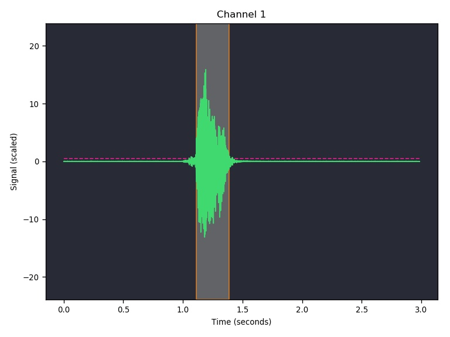
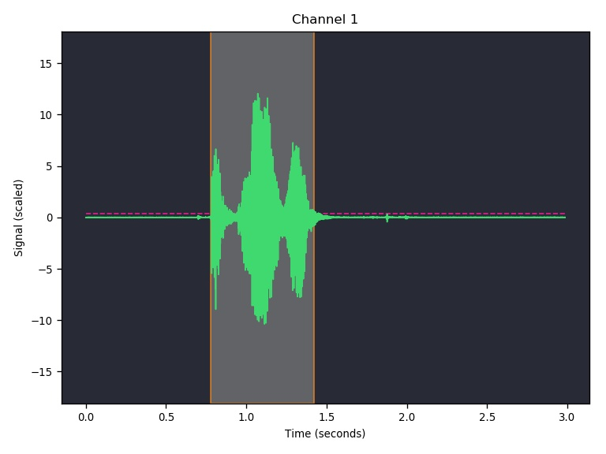
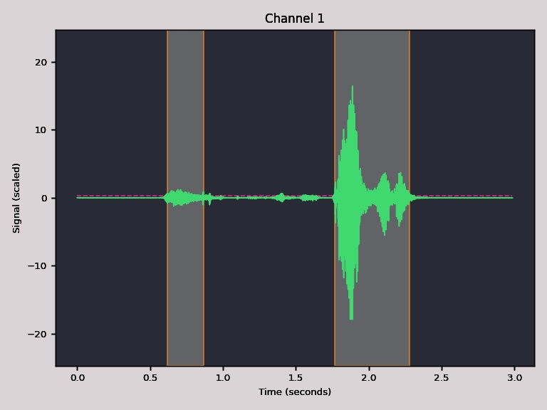

# What it does
Checks recordings from PsychoPy naming tasks in Greek and finds if the word which must have been said, was said. Also finds (somewhat, read caveats) the response latency.
Appends whatever it finds on a new .csv file, namely the word identified, if it was a match, response latency, if found, and time regions (sometimes it can find two of them,
depending on possible background noise etc.) which are saved as graphs in the recordings directory. 

Checked on Windows and Linux.
# Installation 
1) Install SpeechRecognition (https://pypi.org/project/SpeechRecognition/)
2) Install Auditok (https://pypi.org/project/auditok/)
3) Install Pandas (https://pandas.pydata.org/)
4) Install Matplotlib (https://matplotlib.org/)
5) Find the directory where speech_recognition is installed (e.g. on linux .local/lib/python3.8/site-packages/speech_recognition/)
6) Download the greek model by Fotis Pantazoglou (https://sourceforge.net/projects/cmusphinx/files/Acoustic%20and%20Language%20Models/Greek/)
7) Uncompress to /speech_recognition/pocketsphinx-data/el-gr/ (create the el-gr directory) and rename the respective files as the en-US directory filenames

# Before you run
Change the script `df[resp.filename]` to the respective identifier pointing to the saved recordings.

# Run
`python3 speechAnalysis.py <yourlogfile.csv>` (Linux)

`python speechAnalysis.py <yourlogfile.csv>` (Windows)

# Caveats
1) Check the recordings paths before you run, or else you get an error (e.g. log file produced in Windows and the analysis running on Linux)
2) Response latencies are approximate a lot of times, that's why the graphs are saved, in order to be inspected by eye and decide if they are satisfying. E.g.

3) Documentation at https://github.com/Uberi/speech_recognition/blob/master/speech_recognition/__init__.py states that 1.0 in keyword searching is the most sensitive,
(more false positives) and 0.0 the least sensitive (more false negatives). In testing it has been found that the inverse holds. To be tested
furthermore and possibly submitted as a correction?
4) Parameters in find_regions are empirical. Sensitivity mentioned above is also empirical, given that it's more important not to have any false positives
in cost of more false negatives. Change according to your needs

# Some observations
Stressed characters (e.g. έ, ϋ etc.) do not seem to be taken into account by the model.
